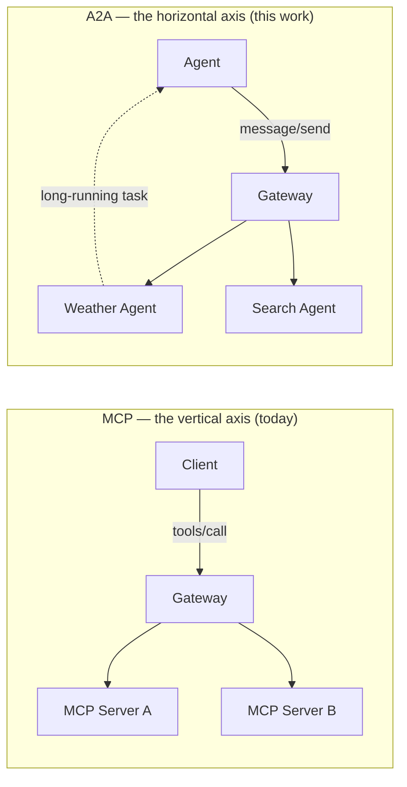
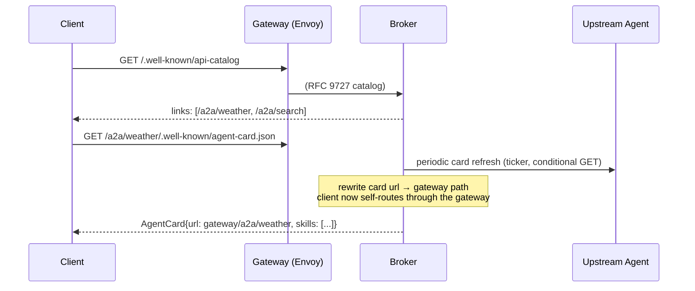
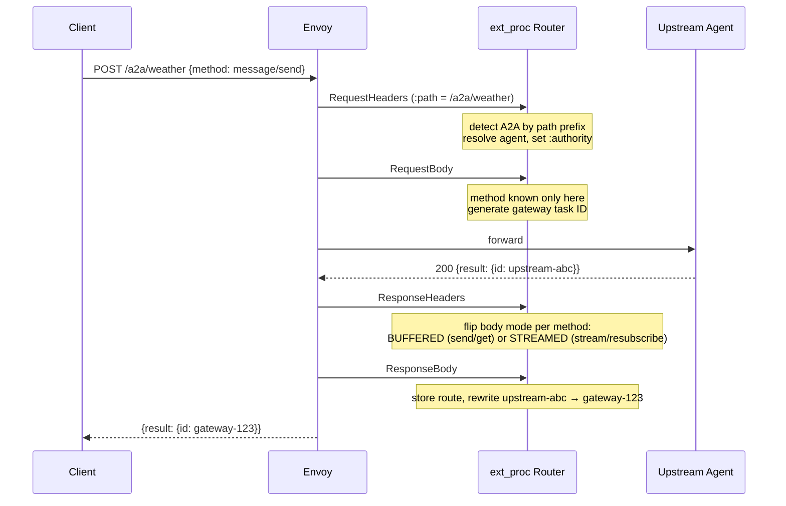
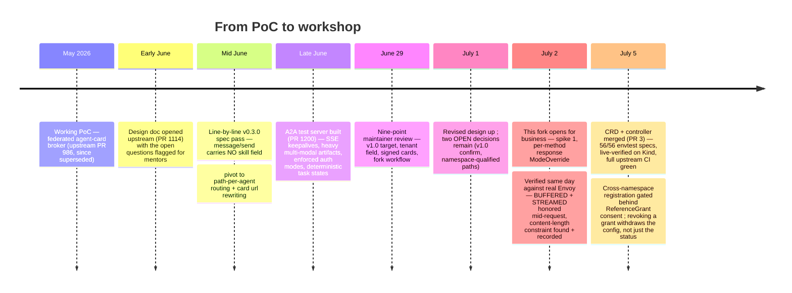
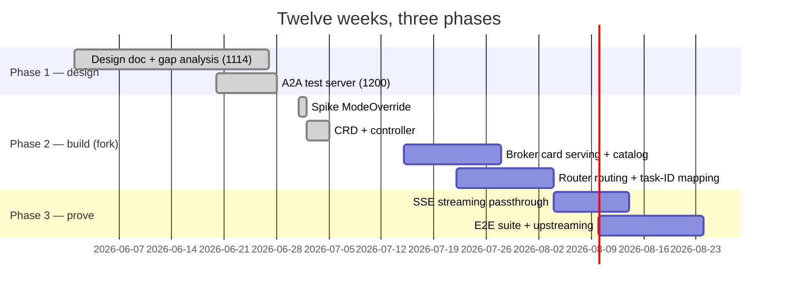

# A2A Protocol Support : Exploration Fork

> [!IMPORTANT]
> This is a **workshop fork** of [Kuadrant/mcp-gateway](https://github.com/Kuadrant/mcp-gateway) (the original project README lives [there](https://github.com/Kuadrant/mcp-gateway#readme)). The agreed home for this work is upstream.., the design lands via [#1114](https://github.com/Kuadrant/mcp-gateway/pull/1114), and code upstreams incrementally once proven here. The fork exists so A2A exploration can move fast without carrying MCP regression risk into the main repo ; workshop in the fork, home in-tree.

This fork is where I'm prototyping Agent2Agent (A2A) protocol support for Kuadrant's MCP Gateway, as part of the CNCF LFX mentorship *"Prototype A2A protocol support in the agentic gateway"* (2026 Term 2), mentored by the Kuadrant maintainers. Everything here traces back to an upstream artifact : the design doc, the test server, the review threads and this README is the map.

## The problem, in one paragraph

The MCP Gateway handles the **vertical axis** of agentic workloads.., a single client consuming federated tools from many upstream MCP servers, with Kuadrant's AuthPolicy, RateLimitPolicy, and observability wrapped around every call. But as agentic architectures grow, a **horizontal axis** emerges: agents delegating long-running work to *other agents*, discovering peer capabilities, coordinating over tasks that run for seconds or days. That's what the [A2A protocol](https://a2a-protocol.org) standardizes ; and today, that traffic bypasses the gateway entirely. No auth, no rate limits, no discovery, no audit trail. Every agent-to-agent delegation is a direct connection outside the policy perimeter. This project puts it back inside.

## A2A in two minutes

A2A is an open protocol (originally Google, donated to the Linux Foundation, now at **v1.0**) for communication between *opaque* agents — agents that collaborate without sharing internal memory, tools, or logic. The pieces that matter for a gateway:

- **Agent Cards** .., a JSON manifest served at a well-known path describing what an agent can do (skills), how to reach it (`url` / `supportedInterfaces`), and how to authenticate (`securitySchemes`). Discovery is card-driven: a client reads the card and sends work to whatever URL it advertises.
- **Tasks** .., the unit of work. A `message/send` creates a task that moves through a lifecycle (`submitted → working → completed/failed/canceled`, with `input-required` and `auth-required` detours) and may outlive the request that created it by hours or days. Clients poll with `tasks/get`, cancel with `tasks/cancel`.
- **Streaming** .., `message/stream` subscribes the client to real-time task updates over SSE, carrying multi-modal artifacts (text, files, structured data) as they're produced ; `tasks/resubscribe` reconnects a dropped stream.
- **It complements MCP, not competes** : MCP standardizes agent-to-*tool*, A2A standardizes agent-to-*agent*. A gateway that already routes one is halfway to routing both.

<b>v0.3.0 -> v1.0: what changed (and why this fork targets v1.0)</b>

 

The spec moved under us mid-project, and the maintainer review agreed there's little value building against an already-superseded line. The v1.0 deltas we've verified against the spec repo:

| Surface | v0.3.0 | v1.0 |
|---|---|---|
| Send | `message/send` | `SendMessage` (blocking by default) |
| Stream | `message/stream` | `SendStreamingMessage` |
| Task fetch / cancel | `tasks/get` / `tasks/cancel` | `GetTask` / `CancelTask` (+ `ListTasks`) |
| Resubscribe | `tasks/resubscribe` | `SubscribeToTask` |
| Well-known card path | `/.well-known/agent-card.json` | `/.well-known/a2a` |
| Card endpoint field | top-level `url` | `supportedInterfaces[]` (+ `tenant` for multi-agent hosting) |
| Card integrity | unsigned | JWS signatures over the JCS-canonicalized card |
| Canonical definition | JSON schema | protobuf (`a2a.proto`) ; JSON-RPC binding uses PascalCase methods |

The architecture is version-agnostic — routing, task-ID mapping, CRD, policy attachment all survive the rename. The version-specific surface (method names, well-known path, card shape) is isolated behind one mapping so the version is never load-bearing. That's the design's answer to a fast-moving spec.

## Why a gateway should carry this traffic

The durable value isn't protocol plumbing.., it's that inter-agent traffic picks up the same **Kuadrant policy plane** MCP traffic already has, with zero gateway code per policy: AuthPolicy (OIDC/JWT via Authorino) for who may talk to which agent, RateLimitPolicy (Limitador) for how often, OpenTelemetry traces stitching a task's whole lifecycle across requests, and centralized discovery so clients never need upstream addresses. Kuadrant policies attach to Gateway API HTTPRoutes ; that one fact drives most of the design below.

## How it works

Two flows carry the whole story. Discovery, the broker serves each registered agent's card with its `url` rewritten to the gateway path, which is the load-bearing trick that makes *unmodified* A2A clients route through the gateway:

And invocation.., the ext_proc router detects A2A by path prefix, routes to the right upstream, and isolates task IDs so clients never see upstream identifiers:

## How we got here

The pivot in the middle is the story worth telling: the original design routed by reading a `skill` out of the `message/send` body, and the spec pass revealed that field **doesn't exist** — `MessageSendParams` is `{message, configuration, metadata}`, skills live only in the card. So routing moved to a path per agent (`/a2a/{prefix}`), which is also what [agentgateway](https://agentgateway.dev) converged on, and which turns out to be Kuadrant-optimal anyway.., policies attach to HTTPRoutes, and a path per agent means an *operator can attach a distinct AuthPolicy and RateLimitPolicy per agent*. The protocol forced a change that made the design better.

## Where everything lives

| Workstream | Where | State |
|---|---|---|
| Design doc (routing, CRD, card serving, auth, task store) | [Kuadrant#1114](https://github.com/Kuadrant/mcp-gateway/pull/1114) | in review, all nine review points addressed, two `[OPEN]` decisions pending |
| A2A test server (v0.3.0 surface, e2e target) | [Kuadrant#1200](https://github.com/Kuadrant/mcp-gateway/pull/1200) | draft, CI green, held for the v1.0 confirm, then migrates + goes ready |
| Original PoC (federated card broker) | [Kuadrant#986](https://github.com/Kuadrant/mcp-gateway/pull/986) | closed... pre-pivot, superseded by the design |
| Spike 1 — per-method response ModeOverride | [this fork, PR #1](../../pull/1) | **merged** : verified against real Envoy, BUFFERED + STREAMED both honored mid-request ; surfaced the content-length constraint (recorded in the design doc) |
| CRD + controller (`A2AAgentRegistration`) | [this fork, PR #3](../../pull/3) | **merged** : 56/56 envtest specs, live-verified grant lifecycle on Kind, upstream CI fully green ; consent-gated cross-namespace with revocation withdrawal |
| Broker card cache + catalog, router, task store | this fork, branch per piece | next up : Tasks 7/8 onward, upstreams once proven |
| Stretch + mentor-gated backlog | [issues #5–#10](../../issues) | deferred scope, each with its why.., three self-executable, three needing mentor decisions |

## The plan

- [x] Analysis of A2A vs MCP traffic patterns (request/response vs long-running tasks, push, multi-modal artifacts)
- [x] Design doc: ext_proc routing, federated card serving, session implications, CRD design
- [x] Deterministic A2A test server for e2e
- [x] Spike: mid-request response mode change (the one piece the review flagged as *"haven't seen it done before... good to derisk early"*) — verified, works ; one constraint found and recorded
- [x] `A2AAgentRegistration` CRD + controller (config fan-out per gateway namespace); merged ahead of plan ; immutable identity fields, ReferenceGrant-gated cross-namespace, revocation withdraws config
- [ ] Broker: card cache behind a pluggable interface, RFC 9727 catalog endpoint
- [ ] Router: path-per-agent routing, gateway-owned task IDs, buffered + streamed rewrites
- [ ] E2E: discovery, task execution, streaming, auth, MCP regression

If the schedule slips, the must-have order is CRD/controller -> card serving -> routing -> e2e ; streaming passthrough and metrics defer first.

## Design decisions, and why

<b>1 : Path-per-agent routing, not skill dispatch</b>

 

The protocol never routes by skill... no `skill` field exists in `message/send` (§7.1.1, both spec versions). The two honest options were a path per agent or a custom header ; a header only works for clients we've specifically taught about the gateway, while a path works for *any* stock A2A client, because clients already POST to whatever URL the agent card advertises. The card the gateway serves points at `/a2a/{prefix}`; so the routing key lives in the card, not in anything the client has to be told. It's also what agentgateway (Linux Foundation) does, and it gives each agent its own HTTPRoute for per-agent policy attachment.

<b>2 : Card url rewriting is load-bearing (and the v1.0 signed-card tension)</b>

 

If the broker proxied upstream cards through unchanged, a client would read the upstream `url` and talk *directly* to the agent... silently bypassing the gateway: no AuthPolicy, no rate limits, no logs, and nothing errors. So the served card's `url` is rewritten to the gateway path ; that single rewrite is what makes unmodified clients route through the policy perimeter.

v1.0 complicates it: cards can carry JWS signatures over the canonicalized card, and the signature covers the URL — a rewritten card is an invalidated signature. The direction under discussion upstream: route by path prefix (and v1.0's `tenant` field, which exists precisely for multiple agents behind one endpoint) and serve signed cards **verbatim**, with the catalog advertising the gateway endpoint. The open dependency.., whether clients reliably discover via catalog/tenant rather than the card's own interface URL; is flagged in the design rather than hand-waved.

<b>3 : Gateway-owned task IDs</b>

 

Clients never see upstream task IDs. The router generates a gateway ID at the request, stores the `(gateway ID → agent, upstream ID)` route when the upstream's response reveals its ID, and rewrites every subsequent surface... response bodies, SSE events (`result.id`, `result.taskId`, `history[].taskId`), poll requests. Task ownership binds to the authenticated principal, so one client can't probe or cancel another's task by guessing IDs. Routes die on terminal task states ; a fixed Redis TTL backstops crashes, deliberately decoupled from session lifetime because A2A tasks can outlive any session.

<b>4 : Per-method response body mode (the current spike)</b>

 

Non-streaming methods (`message/send`, `tasks/get`) need the *whole* response body in one pass to rewrite the task ID — Envoy's `BUFFERED` mode. Streaming methods (`message/stream`, `tasks/resubscribe`) need chunks as they arrive — `STREAMED`. The method is only known at the request-body phase, so the router must flip the mode **mid-request** at response-headers via ext_proc `ModeOverride`. The gateway already half-proved this (the elicitation path flips to STREAMED) ; choosing the mode per method, and the BUFFERED half, was the new bit, and spike 1 verified it against real Envoy (Istio 1.27): both directions honored, the client received the rewritten gateway task id through a mode selected mid-request. The spike also surfaced the one constraint: a buffered rewrite changes the body length, so `content-length` must be stripped in the same response-headers response; Envoy fails closed on the mismatch otherwise. Recorded in the design doc's `message/send` section ; transcripts in [PR #1](../../pull/1).

<b>5 : Two auth paths that must never mix</b>

 

Card fetching (broker → agent, no client involved) uses the registration's `credentialRef`; a static credential the router can never see. Task invocation (a real client behind every call) forwards the *client's* identity; bearer pass-through or, recommended, RFC 8693 token exchange re-audienced to the agent via Authorino. Injecting the gateway's static credential into client calls would be the classic confused-deputy: the agent loses the caller's identity and a low-privilege client rides the gateway's credential. Same split MCP already enforces, for the same reason.

<b>6 : Cross-namespace registration needs the route namespace's consent</b>

 

Being able to create a registration in namespace A is not permission to expose namespace B's agent through the gateway — that would let a tenant register another tenant's backend with no signal and no veto. So a cross-namespace `targetRef` requires a `ReferenceGrant` in the route's namespace (`from: A2AAgentRegistration`, `to: HTTPRoute`), the Gateway API's own consent primitive and the same model the extension controller already uses.., a boundary the maintainers held firm on for the sibling MCP fix, adopted here from day one. The controller watches grants, so consent takes effect within a reconcile in both directions ; and crucially, revoking a grant *withdraws the agent's config*, not just the status, everywhere else config is last-known-good on failure (a transient error must never rip a live agent out of the data plane), but consent is an explicit state, and consent withdrawn means exposure withdrawn. Identity fields (`agentPrefix`, `targetRef`) are immutable by CEL for the same reason: a retarget across gateways would require cleaning stale namespace fan-out config from the previous target, so replacing an agent means replacing the registration.., blue/green swaps happen at the HTTPRoute's `backendRef`, which the controller watches.

## Reading list

The primary sources this work leans on : the [A2A specification](https://a2a-protocol.org/latest/specification/) and [what's new in v1.0](https://a2a-protocol.org/latest/whats-new-v1/) ; [RFC 9727](https://www.rfc-editor.org/rfc/rfc9727) (api-catalog well-known URI) and [RFC 9264](https://www.rfc-editor.org/rfc/rfc9264) (Linkset) for discovery ; [agentgateway](https://agentgateway.dev) as prior art for route-per-agent + card rewriting ; the upstream [design doc](https://github.com/Kuadrant/mcp-gateway/pull/1114) where the decisions above are argued in full ; and Kuadrant's own [MCP Gateway docs](https://docs.kuadrant.io) for the platform this extends.

---

Everything here is headed upstream to [Kuadrant/mcp-gateway](https://github.com/Kuadrant/mcp-gateway) if any of it interests you, the design discussion on [#1114](https://github.com/Kuadrant/mcp-gateway/pull/1114) is the room where it's happening, and pushback is genuinely welcome 🙂

